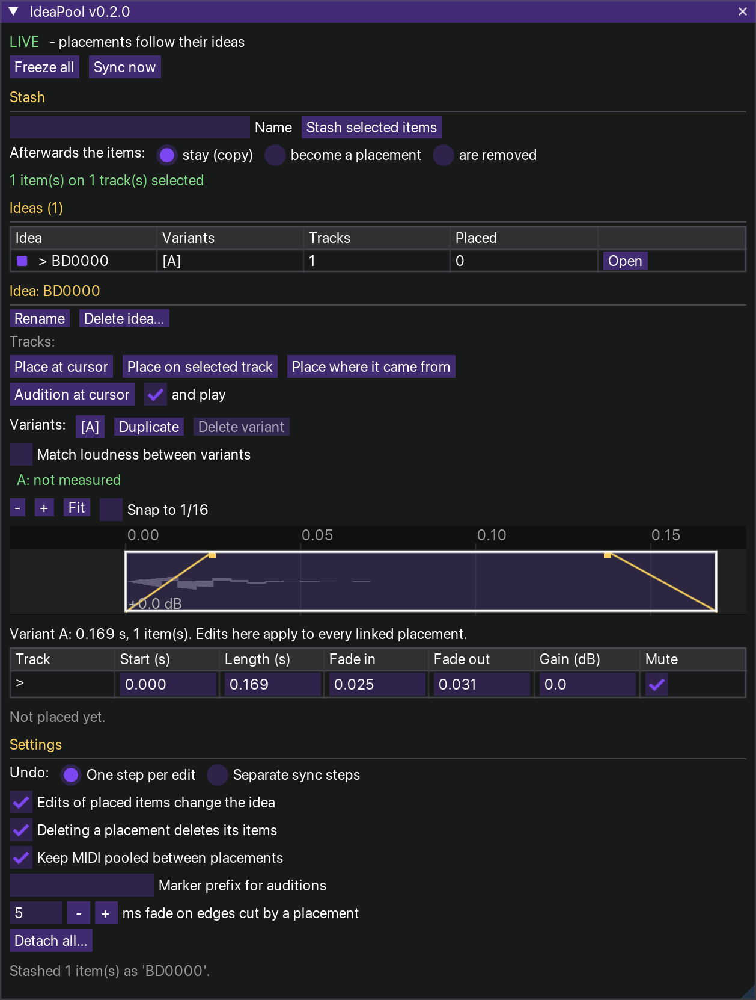

# IdeaPool v0.2.0 – an ideas pool for REAPER



One action (`IdeaPool.lua`) opens a ReaImGui window. **Stash** selected items (any tracks) as an *idea*, keep
**variants** of it, **place** it back as linked copies, and **audition** it anywhere in the song with a marker.
Everything lives in the project.

```
IDEAS    [ Riff · B [1] ]     [ > Riff · B [1] ]      [ * Riff · A [1] ]
            linked               audition (marker)        frozen
Guitar   [gtr~~~~~~~~]        [gtr~~~~~~~~]           [gtr~~~~~~~~]
Bass        [bs~~]               [bs~~]                  [bs~~]
                              ^ marker "Riff"
```

## Install
**macOS (or `--portable` anywhere):** close REAPER, then `./install_mac.sh` (also finds `dist/IdeaPool.lua`); `--uninstall` removes it.
**Manual:** load `dist/IdeaPool.lua` via *Actions → New action → Load ReaScript…*. Needs **ReaImGui**; optional **js_ReaScriptAPI**
(syncing waits until you release the mouse). Running the action again closes the window.

## Stash
Select items and press **Stash selected items**. Afterwards the items (setting, default *stay*):
**stay** (the idea is a copy) · **become a placement** (linked from then on) · **are removed**.
The idea remembers the items with everything REAPER stores about them (take FX, envelopes, fades …), the tracks they
were on, and the level of their audio (50 ms frames, as in GainStageEQ).

## Place
**Place at cursor** (on the tracks it came from), **Place on selected track** (first track there, the others keep their
distance), **Place where it came from**. A placement is an empty MIDI item on the **IDEAS** track plus the real items:
* move / trim / split / copy the placement item like any item – its items follow (the AliasTrack engine);
  cutting one of its items cuts the placement;
* **linked**: edit an item in any placement (move, trim, fades, volume, pitch, rate, mute) and every linked placement follows;
* **Freeze**: this placement stops following (and its edits stay its own); **Unfreeze** shows the idea again;
* **Detach**: its items become plain items; deleting the placement item deletes its items (setting);
* **MIXED** + **Apply / Revert** for what cannot follow automatically (an item deleted, moved past the placement edge,
  moved to another track – Apply then uses that track for this placement).

## Variants and loudness-matched A/B
**Duplicate** makes variant B from the active one; edits in placements go into the active variant. Click **A** / **B** to
switch every linked placement – the items are updated in place. **Save as variant** turns what a placement looks like
now (e.g. a frozen one you reworked) into a new active variant. Items can also be edited numerically in the window
(start, length, fades, gain, mute).
**Match loudness between variants** plays every variant at the level of the *reference* variant (gated average, like
GainStageEQ), so switching compares the sound, not the volume. The real volumes are kept; turning matching off restores them.

## The idea view (v0.2)
The active variant is drawn like a small arrange view: one row per track, each item with its **waveform** (read from
REAPER's peaks of the file, prepared in the background) or, for MIDI, its **notes**. Edit with the mouse:

| Drag | Does |
|---|---|
| the body | move the item inside the idea |
| the left / right edge | trim (the left edge also moves the file offset, like REAPER; it stops at the file's start and end) |
| the small handles in the top corners | fade in / fade out |
| the top edge | gain (4 px per dB, up = louder) |

Every drag is **one undo step** and reaches every linked placement. **Snap to 1/16** uses the tempo where the idea was
stashed. **− / + / Fit** and the scroll slider zoom; the green line is the playhead while a placement of the idea plays.
Hovering shows start, length, fades and gain. Clicking a **MIDI** item opens a larger, read-only **piano roll** (edit
notes in a placement: pooled placements share them, **Save as variant** keeps them in the idea).
The table below the view still takes exact numbers.

## Audition in context (markers)
Name a marker like an idea (case and spaces ignored – the PrototypeSequence rule; optional prefix such as `idea:`):
the idea plays there, following the marker; a **region** trims it to the region. Rename or delete the marker and it
is gone. **Commit** keeps it as an ordinary placement (the marker is renamed `(placed) …`).
**Audition at cursor** adds such a marker and starts playback.

## Undo, storage, settings
One undo step per command; syncs add none by default (*One step per edit*) – or one each (*Separate sync steps*).
The pool is JSON in the IDEAS track's `P_EXT` (saved with the project, part of undo); placements and items are tagged,
never recognised by names. Settings: live / freeze all, undo mode, edits change the idea, delete items with placement,
keep MIDI pooled, marker prefix, fade on cut edges, stash mode. **Detach all** forgets the pool, items stay.

## Development
`./tools/run_tests.sh` builds `dist/IdeaPool.lua` and runs the offline tests (Lua 5.3+) against a mock REAPER.
`DESIGN.md`: model, decisions, shared code with AliasTrack. `spikes/`: what to confirm in real REAPER.
MIT licence.
